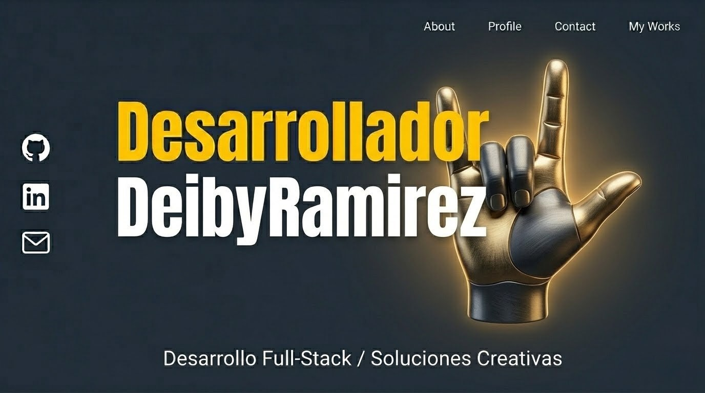

  

# ¡Hola! Soy Deiby Ramirez (Cheiviz) 👋

### Desarrollador de Software | Ingeniería de Software y Computación

Desarrollador apasionado por crear soluciones tecnológicas con impacto real. Me enfoco en construir aplicaciones móviles robustas y arquitecturas backend escalables.

---

### 🚀 Sobre mí

- 🎓 Estudiante de **Ingeniería de Software y Computación** en la Corporación Universitaria Autónoma del Cauca.
- 🔬 Investigador en software educativo (creador de **C_F_E**, registrado ante la DNDA).
- 🛠️ Interesado en optimización de sistemas, ciberseguridad y soluciones creativas.

---

### 🛠️ Tecnologías y Herramientas

#### **Lenguajes y Frameworks**

#### **Bases de Datos**

#### **Herramientas de Entorno**

---

### 📊 Mis Estadísticas de GitHub

  
  

---

### 🌟 Proyectos Destacados

- **C_F_E (Cálculo de Fuerzas Eléctricas):** Software de simulación 3D registrado oficialmente.
- **Trahygo:** Plataforma de delivery para el soporte de comercio local.
- **UAC Pendulum Lab:** Proyecto de investigación para medición de gravedad.

---

### 📫 Conecta conmigo

